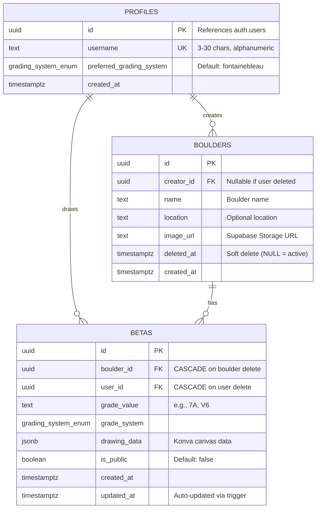

# BetaGraph - Database Schema

**Version**: 1.0.0  
**Date**: 2026-01-17  
**Status**: ✅ Production Ready

---

## Overview

BetaGraph utilizes a **2-table model** to separate physical climbing boulders from user-drawn betas (routes). This design enables:
- **Multi-beta per boulder**: Multiple users can trace different routes on the same image
- **Image deduplication**: One boulder image shared across many betas
- **Social UX**: Discovery of alternative routes on the same boulder

---

## Entity-Relationship Diagram



---

## Tables

### `public.profiles`

Extension de `auth.users` avec les données spécifiques à BetaGraph.

| Column | Type | Constraints | Description |
|--------|------|-------------|-------------|
| `id` | `uuid` | PK, FK → `auth.users(id)` ON DELETE CASCADE | User ID (Supabase Auth) |
| `username` | `text` | UNIQUE, NOT NULL, CHECK (3-30 chars, alphanumeric) | Display username |
| `preferred_grading_system` | `grading_system_enum` | NOT NULL, DEFAULT 'fontainebleau' | User's preferred grading system |
| `created_at` | `timestamptz` | NOT NULL, DEFAULT NOW() | Profile creation timestamp |

**Indexes**:
- `idx_profiles_username` on `username`

**Relationships**:
- 1 profile → N boulders (creator_id)
- 1 profile → N betas (user_id)

---

### `public.boulders`

Physical climbing boulders (images + metadata).

| Column | Type | Constraints | Description |
|--------|------|-------------|-------------|
| `id` | `uuid` | PK, DEFAULT gen_random_uuid() | Boulder ID |
| `creator_id` | `uuid` | FK → `profiles(id)` ON DELETE SET NULL | User who uploaded the image |
| `name` | `text` | NOT NULL, CHECK (length > 0) | Boulder name |
| `location` | `text` | NULLABLE | Optional location (e.g., "Fontainebleau") |
| `image_url` | `text` | NOT NULL | URL to image in Supabase Storage |
| `deleted_at` | `timestamptz` | NULLABLE, DEFAULT NULL | Soft delete timestamp |
| `created_at` | `timestamptz` | NOT NULL, DEFAULT NOW() | Upload timestamp |

**Indexes**:
- `idx_boulders_creator` on `creator_id` WHERE `creator_id IS NOT NULL`
- `idx_boulders_active` on `created_at DESC` WHERE `deleted_at IS NULL`

**Relationships**:
- 1 boulder → N betas (boulder_id)
- N boulders ← 1 profile (creator)

**Soft Delete**:
- `deleted_at IS NULL` → Boulder is active
- `deleted_at IS NOT NULL` → Boulder is soft-deleted (betas preserved)

---

### `public.betas`

User-drawn climbing routes (betas) on boulders.

| Column | Type | Constraints | Description |
|--------|------|-------------|-------------|
| `id` | `uuid` | PK, DEFAULT gen_random_uuid() | Beta ID |
| `boulder_id` | `uuid` | FK → `boulders(id)` ON DELETE CASCADE, NOT NULL | Reference to boulder |
| `user_id` | `uuid` | FK → `profiles(id)` ON DELETE CASCADE, NOT NULL | User who drew this beta |
| `grade_value` | `text` | NOT NULL, CHECK (length > 0) | Grade as string (e.g., "7A", "V6") |
| `grade_system` | `grading_system_enum` | NOT NULL | Grading system used |
| `drawing_data` | `jsonb` | NOT NULL | Konva canvas drawing data |
| `is_public` | `boolean` | NOT NULL, DEFAULT false | Public visibility flag |
| `created_at` | `timestamptz` | NOT NULL, DEFAULT NOW() | Creation timestamp |
| `updated_at` | `timestamptz` | NOT NULL, DEFAULT NOW() | Auto-updated via trigger |

**Indexes**:
- `idx_betas_boulder` on `boulder_id`
- `idx_betas_user` on `user_id`
- `idx_betas_public` (partial) on `is_public, created_at DESC` WHERE `is_public = true`
- `idx_betas_updated` on `updated_at DESC`

**Relationships**:
- N betas ← 1 boulder
- N betas ← 1 profile (creator)

**Trigger**:
- `update_betas_updated_at` → Auto-updates `updated_at` on every UPDATE

---

## Enums

### `grading_system_enum`

```sql
CREATE TYPE grading_system_enum AS ENUM ('fontainebleau', 'v_scale');
```

**Values**:
- `fontainebleau`: European system (3, 4, 5, 5+, 6A, 6A+, 6B, ..., 9A)
- `v_scale`: American V-Scale (VB, V0, V1, ..., V17)

---

## Triggers

### `update_betas_updated_at`

**Purpose**: Automatically update `betas.updated_at` timestamp on row updates.

**Function**:
```sql
CREATE OR REPLACE FUNCTION public.update_updated_at_column()
RETURNS TRIGGER AS $$
BEGIN
  NEW.updated_at = NOW();
  RETURN NEW;
END;
$$ LANGUAGE plpgsql;
```

**Trigger**:
```sql
CREATE TRIGGER update_betas_updated_at
  BEFORE UPDATE ON public.betas
  FOR EACH ROW
  EXECUTE FUNCTION public.update_updated_at_column();
```

**Usage**: Conflict resolution for syncing client/server states.

---

## Storage Buckets

### `boulders` (Private)

| Property | Value |
|----------|-------|
| **Public** | `false` (RLS-protected) |
| **Max Size** | 10 MB |
| **Allowed Types** | `image/jpeg`, `image/png`, `image/webp` |

**Usage**: Original boulder images uploaded by users.

**RLS Policies** (Phase 2.3):
- SELECT: Public if `boulders.is_public = true`, own only otherwise
- INSERT/UPDATE/DELETE: Own files only

---

### `thumbnails` (Public)

| Property | Value |
|----------|-------|
| **Public** | `true` |
| **Max Size** | 2 MB |
| **Allowed Types** | `image/jpeg`, `image/png`, `image/webp` |

**Usage**: Canvas snapshot thumbnails for OpenGraph meta tags.

**RLS Policies** (Phase 2.3):
- SELECT: Public (no restrictions)
- INSERT/UPDATE/DELETE: Authenticated users only

---

## Row Level Security (RLS)

**Status**: ✅ Enabled on all tables  
**Policies**: 🚧 To be implemented in Phase 2.3

All tables have RLS enabled:
```sql
ALTER TABLE public.profiles ENABLE ROW LEVEL SECURITY;
ALTER TABLE public.boulders ENABLE ROW LEVEL SECURITY;
ALTER TABLE public.betas ENABLE ROW LEVEL SECURITY;
```

**Planned Policies** (Phase 2.3):
- **profiles**: SELECT → public, INSERT/UPDATE → own only
- **boulders**: SELECT → public if active + not deleted, INSERT/UPDATE/DELETE → own only
- **betas**: SELECT → public if `is_public = true`, INSERT/UPDATE/DELETE → own only

---

## Cascade Behavior

### User Deletion (`profiles`)

```
DELETE profile → CASCADE to betas (DELETE)
              → SET NULL on boulders.creator_id
```

**Rationale**: Preserve boulders even if original uploader deletes account.

---

### Boulder Deletion (`boulders`)

```
DELETE boulder → CASCADE to betas (DELETE all associated betas)
```

**Alternative**: Soft delete via `deleted_at` (recommended).

---

## Example Queries

### Get all betas for a boulder

```sql
SELECT 
  betas.*,
  profiles.username
FROM public.betas
JOIN public.profiles ON betas.user_id = profiles.id
WHERE betas.boulder_id = 'boulder-uuid-here'
  AND betas.is_public = true
ORDER BY betas.created_at DESC;
```

### Get user's boulders with beta count

```sql
SELECT 
  boulders.*,
  COUNT(betas.id) as beta_count
FROM public.boulders
LEFT JOIN public.betas ON boulders.id = betas.boulder_id
WHERE boulders.creator_id = 'user-uuid-here'
  AND boulders.deleted_at IS NULL
GROUP BY boulders.id
ORDER BY boulders.created_at DESC;
```

### Public feed of recent betas

```sql
SELECT 
  betas.*,
  boulders.name as boulder_name,
  boulders.image_url,
  profiles.username
FROM public.betas
JOIN public.boulders ON betas.boulder_id = boulders.id
JOIN public.profiles ON betas.user_id = profiles.id
WHERE betas.is_public = true
  AND boulders.deleted_at IS NULL
ORDER BY betas.created_at DESC
LIMIT 20;
```

---

## TypeScript Integration

**Generated Types**: [`src/types/database.types.ts`](file:///f:/Portfolio/dev/BetaGraph/src/types/database.types.ts)

**Usage**:

```typescript
import { Database } from '@/types/database.types';
import { Beta, Boulder, Profile } from '@/lib/supabase/database.types';

// Typed Supabase client
const supabase = createClient<Database>(...);

// Insert a beta
const betaData: BetaInsert = {
  boulder_id: '...',
  user_id: '...',
  grade_value: '7A',
  grade_system: 'fontainebleau',
  drawing_data: { lines: [...], shapes: [...] },
  is_public: true,
};

const { data, error } = await supabase
  .from('betas')
  .insert(betaData)
  .select()
  .single();
```

---

## Migration Files

1. **[`001_initial_schema.sql`](file:///f:/Portfolio/dev/BetaGraph/migrations/001_initial_schema.sql)**  
   Tables, indexes, triggers, RLS enablement
   
2. **[`002_storage_buckets.sql`](file:///f:/Portfolio/dev/BetaGraph/migrations/002_storage_buckets.sql)**  
   Storage buckets configuration

**Execution**: Via Supabase Dashboard → SQL Editor (copy-paste)

---

## Notes

### Why 2 Tables?

**Scenario**: 3 users visit the same boulder "Karma" in Fontainebleau.

**1-table model** (fusionnée):
- Alice uploads "Karma" → 1 row
- Bob uploads "Karma" (same image) → 2nd row (duplication!)
- Charlie uploads "Karma" → 3rd row (triplication!)

**2-table model** (séparée):
- Alice uploads "Karma" → 1 boulder
- Alice creates beta → 1 beta (references boulder)
- Bob creates beta → 2nd beta (same boulder reference)
- Charlie creates beta → 3rd beta (same boulder reference)

**Result**: 1 image, 3 betas, no duplication.

---

### Soft Delete Strategy

Boulders use `deleted_at` instead of hard delete to:
- Preserve betas even if original boulder is "deleted"
- Enable potential "undelete" feature
- Maintain data integrity for analytics

**Queries** filter `WHERE deleted_at IS NULL` to show only active boulders.

---

## Status

| Component | Status |
|-----------|--------|
| **Schema Design** | ✅ Complete |
| **SQL Migrations** | ✅ Ready for execution |
| **TypeScript Types** | ✅ Generated |
| **RLS Policies** | 🚧 Phase 2.3 |
| **Storage Policies** | 🚧 Phase 2.3 |

---

**Last Updated**: 2026-01-17  
**Next Phase**: 2.3 - Politiques RLS (Row Level Security)
