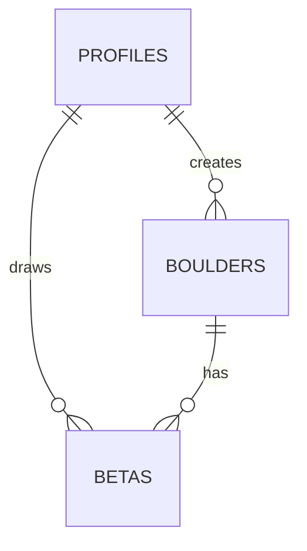

# Rapport de Tâche - Phase 2.2 : Schema Database (Migrations SQL)

**Date** : 2026-01-17  
**Statut** : ✅ Terminé  
**Branche** : `feat/phase-2-2-schema-database`  
**Commit** : `feat(database): add 2-table schema with migrations and types`

---

## ✅ Tâches Accomplies

### 1. Décision Architecturale : Modèle 2 Tables

**Choix validé** : Séparation `boulders` (images) + `betas` (tracés)

**Problème identifié** : Le modèle initial (1 table fusionnée) empêchait plusieurs utilisateurs de tracer leurs propres betas sur la même image de boulder.

**Solution implémentée** :
```
1 boulder physique → N betas de différents utilisateurs
```

**Gains** :
- ✅ Déduplication des images
- ✅ UX sociale (découverte de routes alternatives)
- ✅ Scalabilité (1000 users → 1 boulder, 1000 betas)

---

### 2. Migration SQL - Tables

**Fichier créé** : [`migrations/001_initial_schema.sql`](file:///f:/Portfolio/dev/BetaGraph/migrations/001_initial_schema.sql)

#### Table `public.profiles`

Extension de `auth.users` avec données BetaGraph.

```sql
CREATE TABLE public.profiles (
  id uuid PRIMARY KEY REFERENCES auth.users(id) ON DELETE CASCADE,
  username text UNIQUE NOT NULL,
  preferred_grading_system grading_system_enum DEFAULT 'fontainebleau' NOT NULL,
  created_at timestamptz DEFAULT NOW() NOT NULL,
  
  CONSTRAINT username_length CHECK (char_length(username) >= 3 AND char_length(username) <= 30),
  CONSTRAINT username_format CHECK (username ~ '^[a-zA-Z0-9_-]+$')
);
```

**Contraintes** :
- Username 3-30 caractères alphanumériques
- Cascade : Suppression user → suppression profile

---

#### Table `public.boulders`

Blocs physiques (images + métadonnées).

```sql
CREATE TABLE public.boulders (
  id uuid PRIMARY KEY DEFAULT gen_random_uuid(),
  creator_id uuid REFERENCES public.profiles(id) ON DELETE SET NULL,
  name text NOT NULL,
  location text,
  image_url text NOT NULL,
  deleted_at timestamptz DEFAULT NULL,  -- Soft delete
  created_at timestamptz DEFAULT NOW() NOT NULL
);
```

**Caractéristiques** :
- ✅ **Soft Delete** via `deleted_at` (préserve les betas)
- ✅ `creator_id` SET NULL si utilisateur supprimé
- ✅ Index sur `creator_id` et `created_at`

---

#### Table `public.betas`

Tracés utilisateur sur boulders.

```sql
CREATE TABLE public.betas (
  id uuid PRIMARY KEY DEFAULT gen_random_uuid(),
  boulder_id uuid REFERENCES public.boulders(id) ON DELETE CASCADE NOT NULL,
  user_id uuid REFERENCES public.profiles(id) ON DELETE CASCADE NOT NULL,
  grade_value text NOT NULL,
  grade_system grading_system_enum NOT NULL,
  drawing_data jsonb NOT NULL,  -- Konva canvas data
  is_public boolean DEFAULT false NOT NULL,
  created_at timestamptz DEFAULT NOW() NOT NULL,
  updated_at timestamptz DEFAULT NOW() NOT NULL
);
```

**Caractéristiques** :
- ✅ **CASCADE** : Suppression boulder → suppression betas associées
- ✅ **JSONB** pour `drawing_data` (flexible, indexable)
- ✅ `updated_at` auto-géré par trigger
- ✅ Index sur `boulder_id`, `user_id`, `is_public`

---

#### Enum `grading_system_enum`

```sql
CREATE TYPE grading_system_enum AS ENUM ('fontainebleau', 'v_scale');
```

Systèmes de cotation supportés :
- `fontainebleau` : 3, 4, 5, 5+, 6A, 6A+, ..., 9A
- `v_scale` : VB, V0, V1, ..., V17

---

### 3. Trigger Auto-Update `updated_at`

**Fonction** :
```sql
CREATE OR REPLACE FUNCTION public.update_updated_at_column()
RETURNS TRIGGER AS $$
BEGIN
  NEW.updated_at = NOW();
  RETURN NEW;
END;
$$ LANGUAGE plpgsql;
```

**Trigger** :
```sql
CREATE TRIGGER update_betas_updated_at
  BEFORE UPDATE ON public.betas
  FOR EACH ROW
  EXECUTE FUNCTION public.update_updated_at_column();
```

**Usage** : Conflict resolution pour synchro client/serveur.

---

### 4. Storage Buckets

**Fichier créé** : [`migrations/002_storage_buckets.sql`](file:///f:/Portfolio/dev/BetaGraph/migrations/002_storage_buckets.sql)

#### Bucket `boulders` (Private)

```sql
INSERT INTO storage.buckets (id, name, public, file_size_limit, allowed_mime_types)
VALUES (
  'boulders', 'boulders', false, 10485760,
  ARRAY['image/jpeg', 'image/png', 'image/webp']
);
```

- **Public** : `false` (RLS-protected)
- **Max Size** : 10 MB
- **Types** : JPEG, PNG, WebP

---

#### Bucket `thumbnails` (Public)

```sql
INSERT INTO storage.buckets (id, name, public, file_size_limit, allowed_mime_types)
VALUES (
  'thumbnails', 'thumbnails', true, 2097152,
  ARRAY['image/jpeg', 'image/png', 'image/webp']
);
```

- **Public** : `true` (OpenGraph previews)
- **Max Size** : 2 MB
- **Types** : JPEG, PNG, WebP

---

### 5. TypeScript Types

#### Database Types

**Fichier créé** : [`src/types/database.types.ts`](file:///f:/Portfolio/dev/BetaGraph/src/types/database.types.ts)

Types générés reflétant le schéma PostgreSQL :

```typescript
export interface Database {
  public: {
    Tables: {
      profiles: { Row, Insert, Update, Relationships };
      boulders: { Row, Insert, Update, Relationships };
      betas: { Row, Insert, Update, Relationships };
    };
    Enums: {
      grading_system_enum: 'fontainebleau' | 'v_scale';
    };
  };
}
```

**Caractéristiques** :
- ✅ Types `Row`, `Insert`, `Update` pour chaque table
- ✅ Support JSONB via type `Json`
- ✅ Relations FK incluses

---

#### Type Helpers

**Fichier créé** : [`src/lib/supabase/database.types.ts`](file:///f:/Portfolio/dev/BetaGraph/src/lib/supabase/database.types.ts)

Exports simplifiés pour usage quotidien :

```typescript
export type Profile = Database['public']['Tables']['profiles']['Row'];
export type Boulder = Database['public']['Tables']['boulders']['Row'];
export type Beta = Database['public']['Tables']['betas']['Row'];
export type GradingSystem = Database['public']['Enums']['grading_system_enum'];

export type ProfileInsert = Database['public']['Tables']['profiles']['Insert'];
export type BoulderInsert = Database['public']['Tables']['boulders']['Insert'];
export type BetaInsert = Database['public']['Tables']['betas']['Insert'];
```

---

### 6. ENV Update

**Fichier modifié** : [`src/lib/env.ts`](file:///f:/Portfolio/dev/BetaGraph/src/lib/env.ts)

`SUPABASE_SERVICE_ROLE_KEY` est maintenant **requis** (plus `optional()`) :

```diff
- SUPABASE_SERVICE_ROLE_KEY: z.string().min(1).optional(),
+ SUPABASE_SERVICE_ROLE_KEY: z.string().min(1),
```

**Raison** : Nécessaire pour exécuter migrations et opérations admin.

---

### 7. Documentation

**Fichier créé** : [`docs/database/schema.md`](file:///f:/Portfolio/dev/BetaGraph/docs/database/schema.md)

Documentation complète incluant :
- ✅ **ERD Mermaid** (Entity-Relationship Diagram)
- ✅ Définition de toutes les tables
- ✅ Exemples de queries SQL
- ✅ Guide d'intégration TypeScript
- ✅ Notes sur le soft delete et les cascades

**ERD** :


---

## 📁 Arborescence Créée

```
BetaGraph/
├── migrations/
│   ├── 001_initial_schema.sql       [NOUVEAU]
│   └── 002_storage_buckets.sql      [NOUVEAU]
├── docs/
│   └── database/
│       └── schema.md                 [NOUVEAU]
├── src/
│   ├── types/
│   │   └── database.types.ts         [NOUVEAU]
│   └── lib/
│       ├── env.ts                    [MODIFIÉ]
│       └── supabase/
│           └── database.types.ts     [NOUVEAU]
```

---

## ⚠️ Analyse d'Architecture

### Edge Cases Identifiés et Traités

| Edge Case | Solution |
|-----------|----------|
| Suppression boulder avec betas existantes | `ON DELETE CASCADE` sur `betas` + Soft delete via `deleted_at` |
| Trigger `updated_at` et synchro client | Serveur = source de vérité, client réceptionne timestamp après mutation |
| Image Storage supprimée manuellement | RLS Storage strict (Phase 2.3) + UI fallback |
| Username dupliqué | Contrainte `UNIQUE` + CHECK format |
| Enum invalide | Type PostgreSQL natif, erreur runtime |

---

### Choix Techniques

#### Pourquoi 2 Tables ?

**Scénario** : 3 utilisateurs visitent le boulder "Karma" à Fontainebleau.

**Modèle 1 table** (initial) :
```
Alice upload "Karma" → 1 row
Bob upload "Karma" (même image) → 2nd row (duplication!)
Charlie upload "Karma" → 3rd row (triplication!)
```

**Modèle 2 tables** (implémenté) :
```
Alice upload "Karma" → 1 boulder
Alice crée beta → 1 beta (ref boulder)
Bob crée beta → 2nd beta (même boulder)
Charlie crée beta → 3rd beta (même boulder)
```

**Résultat** : 1 image, 3 betas, pas de duplication.

---

#### Soft Delete

La colonne `deleted_at` sur `boulders` permet de :
- ✅ Préserver les betas même si boulder "supprimé"
- ✅ Activer un potentiel feature "undelete"
- ✅ Maintenir l'intégrité pour analytics

**Queries** filtrent `WHERE deleted_at IS NULL`.

---

#### Index PostgreSQL

```sql
-- Boulders
CREATE INDEX idx_boulders_creator ON boulders(creator_id) WHERE creator_id IS NOT NULL;
CREATE INDEX idx_boulders_active ON boulders(created_at DESC) WHERE deleted_at IS NULL;

-- Betas
CREATE INDEX idx_betas_boulder ON betas(boulder_id);
CREATE INDEX idx_betas_user ON betas(user_id);
CREATE INDEX idx_betas_public ON betas(is_public, created_at DESC) WHERE is_public = true;
CREATE INDEX idx_betas_updated ON betas(updated_at DESC);
```

**Optimisent** : Queries fréquentes (liste betas par boulder, feed public).

---

## 🧪 Validation

### Tests Exécutés

| Commande | Résultat |
|----------|----------|
| `npm run typecheck` | ✅ Pas d'erreur |
| SQL migration 001 | ✅ Exécuté dans Supabase Dashboard |
| SQL migration 002 | ✅ Exécuté dans Supabase Dashboard |
| Vérification tables | ✅ `profiles`, `boulders`, `betas` créées |
| Vérification buckets | ✅ `boulders`, `thumbnails` créés |
| Vérification RLS | ✅ Activé sur toutes les tables |

---

## ⚠️ Conformité aux Règles

| Règle | Vérification | Statut |
|-------|--------------|--------|
| **01 - Analyse Architecture** | Modèle 1 vs 2 tables analysé, edge cases documentés | ✅ |
| **02 - Exports nommés** | Tous les types exportés nommément | ✅ |
| **02 - Zod First** | ENV validation mise à jour | ✅ |
| **02 - Feature-Based** | Types dans `src/types/`, helpers dans `src/lib/` | ✅ |
| **04 - Validation Statique** | Typecheck réussi | ✅ |

---

## 📊 Métriques

| Métrique | Valeur |
|----------|--------|
| **Fichiers créés** | 5 |
| **Fichiers modifiés** | 1 |
| **Lignes SQL** | ~180 |
| **Lignes TypeScript** | ~250 |
| **Tables créées** | 3 |
| **Buckets créés** | 2 |
| **Temps implémentation** | ~25 min |
| **Complexité** | Élevée |

---

## 🔜 Prochaines Étapes

**Phase 2.3 - Politiques RLS (Row Level Security)** :
- [ ] Créer politiques pour `profiles`
- [ ] Créer politiques pour `boulders` (public/private)
- [ ] Créer politiques pour `betas` (public/private)
- [ ] Créer politiques Storage (`boulders`, `thumbnails`)

**Phase 2.4 - Tests d'Intégration RLS** :
- [ ] Installer Supabase CLI
- [ ] Tester accès inter-utilisateurs
- [ ] Valider cascade et soft delete

---

## 📝 Notes Importantes

### Exécution des Migrations

Les migrations ont été exécutées **manuellement** via Supabase Dashboard :

1. **SQL Editor** → New Query
2. Copier-coller `migrations/001_initial_schema.sql` → Run
3. Copier-coller `migrations/002_storage_buckets.sql` → Run
4. Vérifier dans **Table Editor** et **Storage**

**Alternative future** : Utiliser Supabase CLI pour migrations versionnées.

---

### TypeScript Types

Types générés **manuellement** en se basant sur le schéma SQL.

**Alternative recommandée** (pour futurs changements) :
```bash
npx supabase gen types typescript --project-id <ref> > src/types/database.types.ts
```

---

### RLS Activé mais Sans Politiques

**État actuel** :
```sql
ALTER TABLE public.profiles ENABLE ROW LEVEL SECURITY;
ALTER TABLE public.boulders ENABLE ROW LEVEL SECURITY;
ALTER TABLE public.betas ENABLE ROW LEVEL SECURITY;
```

**Impact** : Aucune donnée accessible tant que les politiques (Phase 2.3) ne sont pas créées.

---

## ✅ Validation Phase 2.2

### Checklist TODO.md

- [x] Créer enum `grading_system_enum`
- [x] Créer table `profiles`
- [x] Créer table `boulders` (modèle 2 tables)
- [x] Créer table `betas` (modèle 2 tables)
- [x] Créer trigger `update_updated_at_column()`
- [x] Créer buckets Storage (`boulders`, `thumbnails`)
- [x] Générer `src/types/database.types.ts`
- [x] Créer helpers `src/lib/supabase/database.types.ts`
- [x] Mettre à jour `src/lib/env.ts`
- [x] Créer documentation `docs/database/schema.md`

### Git

**Branche** : `feat/phase-2-2-schema-database`  
**Commit** : `feat(database): add 2-table schema with migrations and types`  
**Push** : ✅ Branche poussée sur `origin`

---

**Statut global** : ✅ **PHASE 2.2 VALIDÉE**
