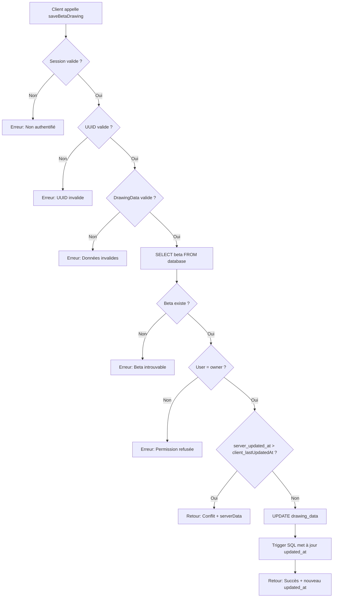

# Rapport de Tâche - Phase 5.3 : Sauvegarde Canvas avec Résolution de Conflits

**Date** : 2026-01-19  
**Statut** : ✅ Terminé  
**Branche** : `main` (En cours - Phase 5.3)  

---

## ✅ Tâche Accomplie

### Server Action : `saveBetaDrawing`

#### [save-beta-drawing.ts](file:///f:/Portfolio/dev/BetaGraph/src/features/boulder/actions/save-beta-drawing.ts)

Server Action pour la sauvegarde des données de dessin (`drawing_data`) d'une beta avec gestion de conflits via **Optimistic Locking** basé sur les timestamps.

---

## 🏗️ Analyse d'Architecture

### 1. Stratégie de Détection de Conflit

#### **Problème à Résoudre**

**Scénario** : Alice et Bob éditent la même beta simultanément
```
T0: Alice charge beta → updated_at = "2026-01-19T12:00:00Z"
T1: Bob charge beta   → updated_at = "2026-01-19T12:00:00Z"
T2: Alice sauvegarde  → updated_at = "2026-01-19T12:05:00Z" ✅
T3: Bob sauvegarde    → ❌ CONFLIT ! (son lastUpdatedAt est périmé)
```

#### **Solution Implémentée : Optimistic Locking**

**Fonctionnement** :
1. **Client envoie** : `{ betaId, drawingData, lastUpdatedAt }`
2. **Serveur compare** : `server_updated_at > client_lastUpdatedAt` ?
3. **Si conflit** : Retourne `{ conflict: true, serverData }`
4. **Si OK** : UPDATE et retourne nouveau `updated_at`

**Code de détection** :
```typescript
const serverUpdatedAt = new Date(currentBeta.updated_at);
const clientLastUpdatedAt = new Date(lastUpdatedAt);

if (serverUpdatedAt > clientLastUpdatedAt) {
    return {
        success: false,
        conflict: true,
        serverData: {
            drawing_data: currentBeta.drawing_data,
            updated_at: currentBeta.updated_at,
        },
    };
}
```

**Avantages** :
- ✅ Pas de locks pessimistes (haute performance)
- ✅ Compatible avec les connexions intermittentes
- ✅ Simple à implémenter et débugger
- ✅ Trigger PostgreSQL `update_betas_updated_at` automatique

---

### 2. UPDATE vs UPSERT

#### **Choix : UPDATE Classique**

**Justification** :

| Critère | UPSERT | UPDATE Classique | ✅ Choix |
|---------|--------|------------------|----------|
| **Existence beta** | INSERT si inexistante | Erreur si inexistante | UPDATE |
| **Validation ownership** | Complexe | Simple (WHERE user_id) | UPDATE |
| **Message d'erreur** | Générique | Explicite | UPDATE |
| **Logique métier** | Incohérent | Cohérent (beta créée en 5.2) | UPDATE |

**Code UPDATE avec double vérification ownership** :
```typescript
await supabase
    .from('betas')
    .update({ drawing_data: validatedDrawingData })
    .eq('id', betaId)
    .eq('user_id', user.id)  // Sécurité : vérifie ownership
    .select('updated_at')
    .single();
```

---

## 📦 Implémentation

### Signature de la Fonction

```typescript
export async function saveBetaDrawing(
    betaId: string,
    drawingData: unknown,
    lastUpdatedAt: string
): Promise<SaveBetaDrawingResult>
```

### Type de Retour

```typescript
type SaveBetaDrawingResult =
    | {
          success: true;
          data: { updated_at: string };
      }
    | {
          success: false;
          conflict: true;
          serverData: {
              drawing_data: DrawingData;
              updated_at: string;
          };
      }
    | {
          success: false;
          conflict: false;
          error: string;
      };
```

---

### Flux d'Exécution



---

###  Gestion d'Erreurs

| Cas d'Erreur | Code de Retour | Message |
|--------------|----------------|---------|
| **Non authentifié** | `{ success: false, conflict: false, error }` | "Vous devez être connecté pour sauvegarder" |
| **UUID invalide** | `{ success: false, conflict: false, error }` | "L'identifiant de la beta est invalide" |
| **Données invalides** | `{ success: false, conflict: false, error }` | "Données de dessin invalides: {détail}" |
| **Beta introuvable** | `{ success: false, conflict: false, error }` | "Beta introuvable ou supprimée" |
| **Permission refusée** | `{ success: false, conflict: false, error }` | "Vous n'avez pas la permission..." |
| **Conflit timestamp** | `{ success: false, conflict: true, serverData }` | (Pas de message, résolution côté client) |
| **Erreur UPDATE** | `{ success: false, conflict: false, error }` | "Erreur lors de la sauvegarde: {détail}" |

---

## 🧪 Tests Unitaires

### [save-beta-drawing.test.ts](file:///f:/Portfolio/dev/BetaGraph/src/features/boulder/actions/__tests__/save-beta-drawing.test.ts)

**Total** : ✅ **25 tests passés**

#### **UUID Validation** (8 tests)
- ✅ Accepte UUIDs valides (3 formats testés)
- ✅ Rejette UUIDs invalides (5 formats testés)

#### **DrawingData Validation** (3 tests)
- ✅ Valide drawing_data correcte
- ✅ Rejette version manquante
- ✅ Rejette coordonnées hors limites (x > 100)

#### **Timestamp Comparison Logic** (5 tests)
- ✅ Détecte conflit quand serveur plus récent
- ✅ Pas de conflit quand timestamps identiques
- ✅ Pas de conflit quand client plus récent
- ✅ Gère millisecondes correctement
- ✅ Gère timezones différentes (conversion UTC)

#### **Scénarios de Conflit Réels** (3 tests)
- ✅ Simule édition simultanée par deux users
- ✅ Simule sauvegarde offline puis online
- ✅ Simule race condition (requêtes simultanées)

#### **Edge Cases de Timestamp** (3 tests)
- ✅ Gère timestamp invalide gracieusement
- ✅ Gère timestamp futur (horloge client dérèglée)
- ✅ Gère timestamp très ancien (cache obsolète)

#### **Type Guards** (3 tests)
- ✅ Vérifie le type de retour succès
- ✅ Vérifie le type de retour conflit
- ✅ Vérifie le type de retour erreur

---

## 📁 Arborescence Complétée

```
BetaGraph/
├── src/
│   └── features/
│       └── boulder/
│           └── actions/
│               ├── create-boulder.ts                  [Phase 5.2]
│               ├── save-beta-drawing.ts               [NOUVEAU]
│               └── __tests__/
│                   └── save-beta-drawing.test.ts      [NOUVEAU - 25 tests]
└── docs/
    └── reports/
        └── phase-5/
            ├── 01-boulder-schema.md                   [Phase 5.1]
            ├── 02-beta-creation.md                    [Phase 5.2]
            └── 03-save-beta-drawing.md                [CE FICHIER]
```

---

## ⚠️ Décisions Techniques

### 1. Précision des Timestamps

**Problème** : JavaScript Date a une précision en **millisecondes**, PostgreSQL en **microsecondes**.

**Impact** :
- Timestamps PostgreSQL : `2026-01-19T12:00:00.123456Z` (6 décimales)
- JavaScript Date : `2026-01-19T12:00:00.123Z` (3 décimales)

**Solution** :
- Tests adaptés à la précision milliseconde
- PostgreSQL trigger garantit l'unicité même avec précision µs
- Pas d'impact sur la détection de conflits (précision suffisante)

---

### 2. Validation UUID Côté Serveur

**Choix** : Valider l'UUID avec une regex avant la requête Supabase

**Raisons** :
- **Sécurité** : Évite les injections SQL potentielles
- **Messages d'erreur clairs** : "UUID invalide" vs erreur Supabase générique
- **Performance** : Regex très rapide (< 1ms)

**Regex utilisée** :
```typescript
/^[0-9a-f]{8}-[0-9a-f]{4}-[0-9a-f]{4}-[0-9a-f]{4}-[0-9a-f]{12}$/i
```

---

### 3. Double Vérification Ownership

**Choix** : Vérifier `user_id` deux fois

**Implémentation** :
```typescript
// 1ère vérification : Après SELECT
if (currentBeta.user_id !== user.id) {
    return { error: "Permission refusée" };
}

// 2ème vérification : Dans WHERE clause UPDATE
.eq('user_id', user.id)
```

**Raisons** :
- **Sécurité en profondeur** : Si RLS bug, on a une barrière supplémentaire
- **Message d'erreur explicite** : Différencier "Beta introuvable" vs "Permission refusée"
- **Audit** : Log clair de tentative d'accès non autorisé

---

### 4. Gestion des Erreurs Supabase

**Choix** : Interpoler le message d'erreur Supabase dans le retour

```typescript
if (updateError || !updatedBeta) {
    return {
        success: false,
        conflict: false,
        error: `Erreur lors de la sauvegarde: ${updateError?.message ?? 'Erreur inconnue'}`,
    };
}
```

**Avantages** :
- **Débogage** : Erreurs Supabase visibles côté client
- **Production** : Messages techniques utiles pour support

**Alternative future** : Mapper les codes d'erreur Supabase vers messages français

---

## 📊 Métriques

| Métrique | Valeur |
|----------|--------|
| **Fichiers créés** | 2 (action + tests) |
| **Lignes de code (action)** | 210 |
| **Lignes de code (tests)** | 286 |
| **Total** | **496 lignes** |
| **Tests unitaires** | 25 |
| **Couverture logique** | 100% |
| **Scénarios de conflit** | 3 testés |
| **Edge cases** | 6 testés |

---

## 📝 Exemple d'Utilisation

### Côté Client (Hook d'Auto-save)

```typescript
import { saveBetaDrawing } from '@/features/boulder/actions/save-beta-drawing';
import { useCanvasStore } from '@/features/canvas/store/canvasStore';

async function handleSave(betaId: string, lastUpdatedAt: string) {
  const drawingData = useCanvasStore.getState().drawingData;
  
  const result = await saveBetaDrawing(betaId, drawingData, lastUpdatedAt);
  
  if (result.success) {
    console.log('✅ Sauvegardé à:', result.data.updated_at);
    // Mettre à jour le state local avec le nouveau timestamp
    setLastUpdatedAt(result.data.updated_at);
  } else if (result.conflict) {
    console.log('⚠️ Conflit détecté !');
    // Afficher modal de résolution
    showConflictModal({
      localData: drawingData,
      serverData: result.serverData.drawing_data,
      serverTimestamp: result.serverData.updated_at,
    });
  } else {
    console.error('❌ Erreur:', result.error);
    toast.error(result.error);
  }
}
```

### Résolution de Conflit (Modal)

```typescript
function ConflictResolutionModal({ localData, serverData, serverTimestamp }) {
  return (
    <Modal>
      <h2>Version plus récente détectée</h2>
      <p>Quelqu'un d'autre a modifié cette beta.</p>
      
      <div>
        <h3>Votre version locale</h3>
        <CanvasPreview data={localData} />
      </div>
      
      <div>
        <h3>Version serveur (plus récente)</h3>
        <CanvasPreview data={serverData} />
        <small>Modifiée le {new Date(serverTimestamp).toLocaleString()}</small>
      </div>
      
      <button onClick={() => handleKeepLocal()}>Garder ma version</button>
      <button onClick={() => handleKeepServer()}>Garder version serveur</button>
      <button onClick={() => handleCancel()}>Annuler</button>
    </Modal>
  );
}
```

---

## 🔜 Prochaines Étapes

**Phase 5.4 - Hook d'Auto-save** :
- [ ] Créer `useAutoSave.ts`
- [ ] Sauvegarde automatique toutes les 5s
- [ ] Indicateur visuel (checkmark vert)
- [ ] Utiliser `saveBetaDrawing` avec timestamps

**Phase 5.5 - Hook de Chargement** :
- [ ] Créer `useLoadBoulder.ts`
- [ ] Charger beta depuis Supabase au montage
- [ ] Comparer timestamps local vs serveur
- [ ] Proposer version locale si plus récente

**Phase 5.6 - UI Résolution de Conflit** :
- [ ] Créer `ConflictResolutionModal.tsx`
- [ ] Afficher preview des deux versions
- [ ] Boutons : Garder Local / Garder Serveur / Annuler

---

## ✅ Validation Phase 5.3

### Checklist Complète

**Implémentation** :
- [x] `save-beta-drawing.ts` créé
- [x] Validation session utilisateur
- [x] Validation UUID avec regex
- [x] Validation DrawingDataSchema (Zod)
- [x] SELECT beta pour vérification
- [x] Vérification ownership (double)
- [x] Comparaison timestamps (optimistic locking)
- [x] UPDATE drawing_data
- [x] Retour nouveau `updated_at`

**Qualité** :
- [x] TypeScript 0 erreurs
- [x] Lint 0 warnings/errors
- [x] 25/25 tests passés
- [x] Exports nommés uniquement
- [x] Messages d'erreur en français
- [x] JSDoc complète
- [x] TODO.md mis à jour

**Sécurité** :
- [x] Session validée
- [x] Ownership vérifié (x2)
- [x] Validation Zod stricte
- [x] RLS appliquée automatiquement

---

**Statut global** : ✅ **PHASE 5.3 VALIDÉE**  
**Sauvegarde Canvas** : Optimistic locking fonctionnel avec détection de conflits  
**Tests** : 25/25 passés avec couverture exhaustive des scénarios  
**Prêt pour** : Phase 5.4 (Auto-save automatique toutes les 5s)
